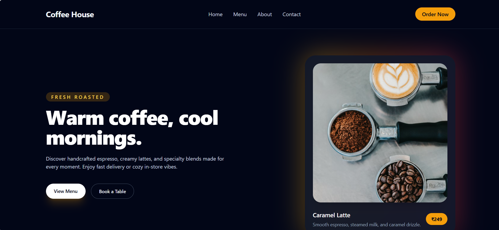
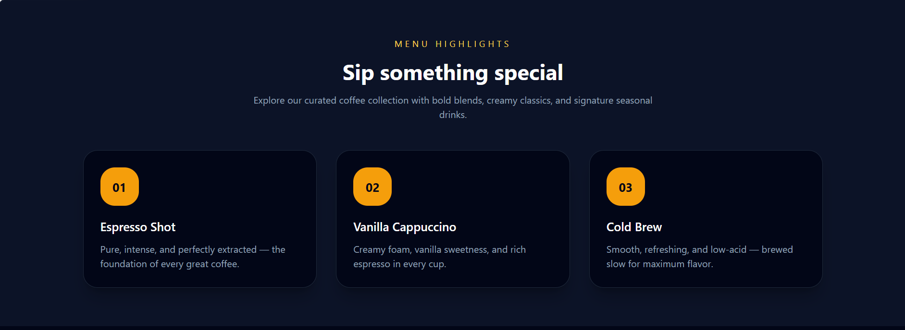
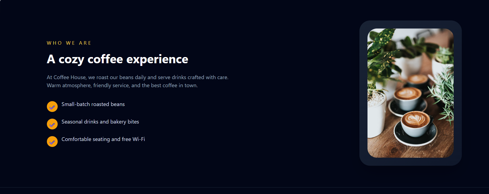
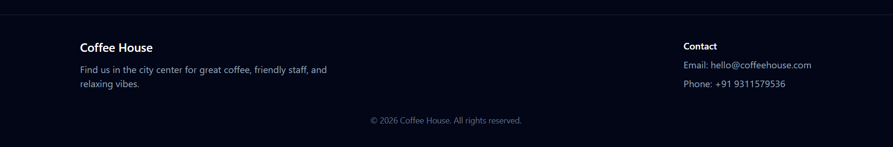
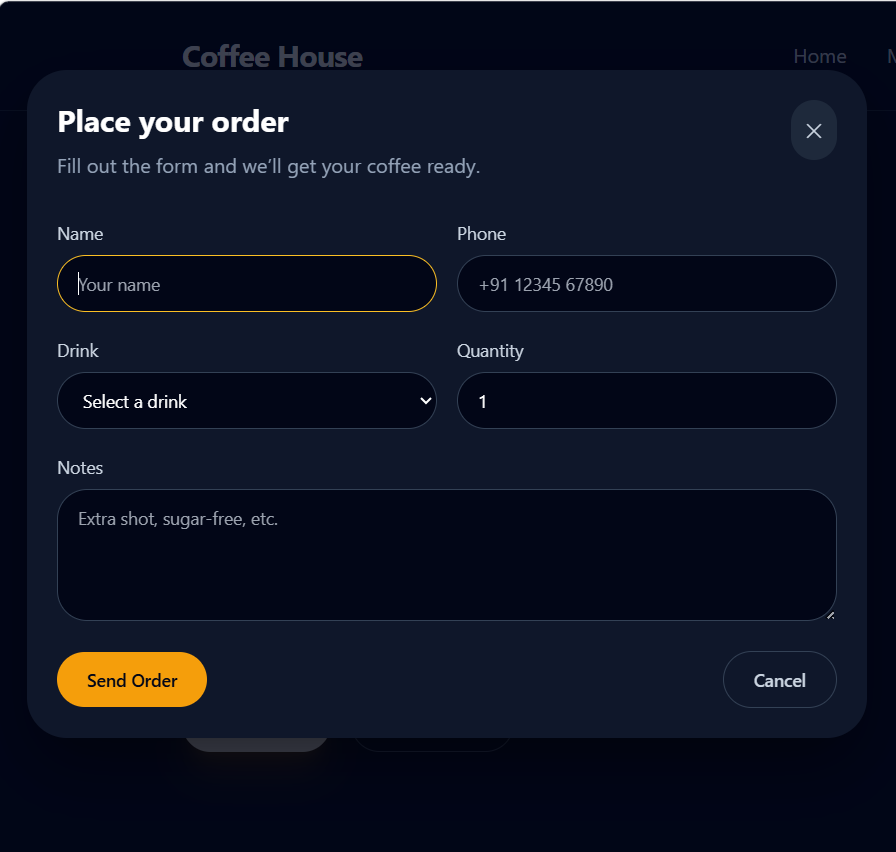

# KOFFEE ☕

A modern coffee shop website built using HTML and Tailwind CSS.

## Features
- Responsive Design
- Modern UI
- Tailwind CSS Styling
- Mobile Friendly

## Folder Structure

KOFFEE/ │
 ├── Screenshot/
  │ 
  ├── 1.png
  ├── 2.png  
  ├── 3.png 
  ├── 4.png  
  └── 5.png 
├── src/ 
│ ├── index.html 
│ ├── input.css
│ └── output.css 
│ 
├── package.json 
└── README.md

## Screenshots
- Navbar and Herosection

- Menu

- About

- Footer and Contact

- Order Now

Author

Aakash